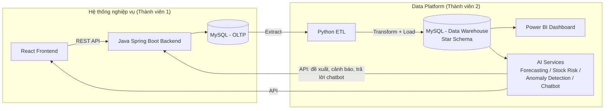

# ERP Quản Lý Kho Thông Minh

Khóa luận tốt nghiệp — Xây dựng hệ thống ERP quản lý kho thông minh (Smart Warehouse Management ERP).

Nhóm 2 thành viên. Công nghệ chính: **Java (Spring Boot)** cho hệ thống nghiệp vụ lõi, **Python** cho ETL/Data Warehouse/AI, **React** cho giao diện, **Power BI** cho báo cáo trực quan.

## Kiến trúc tổng quát



Luồng nghiệp vụ: `SFA/Khách hàng đặt hàng → OMS (Backend) xử lý nhập/xuất/tồn → ETL nạp Data Warehouse → BI + AI phân tích, dự báo, cảnh báo`.

## Cấu trúc thư mục

```
ERPQLKHO/
├── docs/                    ← Tài liệu: yêu cầu, kiến trúc, CSDL, quản lý dự án, API contract
├── backend/                 ← Java Spring Boot — API quản lý danh mục/nhập/bán/tồn kho (Thành viên 1)
├── frontend/                ← React — giao diện người dùng, tham khảo look & feel hệ thống DMS (Thành viên 1)
├── etl/                     ← Python — Extract/Transform/Load OLTP → Data Warehouse (Thành viên 2)
├── data-warehouse/          ← SQL schema Fact/Dimension cho Data Warehouse (Thành viên 2)
├── ai-services/             ← Python (FastAPI) — Forecasting, Stock Risk, Anomaly Detection, Chatbot (Thành viên 2)
├── bi/                      ← Power BI dashboard (.pbix) + tài liệu kết nối nguồn dữ liệu (Thành viên 2)
├── ui-reference/            ← Screenshot UI thật (DMS OMS) tham khảo khi code Frontend — xem README bên trong (có ảnh chứa data thật, đọc lưu ý bảo mật)
├── docker-compose.yml       ← MySQL (OLTP + DW) + Adminer cho local dev
└── .env.example
```

> Chi tiết phân chia công việc theo tuần: xem [`docs/04-project-management/task-breakdown.md`](docs/04-project-management/task-breakdown.md)

## Phân công

| Thành viên | Phụ trách |
|---|---|
| **Thành viên 1** | Java Backend (API), Frontend (React), CSDL OLTP, chức năng Quản lý hệ thống/Danh mục/Nhập hàng/Bán hàng/Tồn kho |
| **Thành viên 2** | Data Warehouse, ETL, BI (Power BI), Forecasting, Stock Risk, Anomaly Detection, AI Chatbot |
| **Cả hai** | Tích hợp API giữa Backend ↔ AI Services, kiểm thử, viết báo cáo khóa luận, triển khai |

## Bắt đầu nhanh (local dev)

### 1. Hạ tầng CSDL (MySQL)
```bash
cp .env.example .env
docker compose up -d          # khởi động MySQL (OLTP + DW) + Adminer (http://localhost:8081)
```

### 2. Backend (Java Spring Boot)
```bash
cd backend
mvn spring-boot:run           # chạy tại http://localhost:8080 (Swagger: /swagger-ui.html)
```

### 3. Frontend (React)
```bash
cd frontend
npm install
npm run dev                   # chạy tại http://localhost:5173
```

### 4. ETL (Python)
```bash
cd etl
pip install -r requirements.txt
python run_etl.py             # extract OLTP → transform → load vào Data Warehouse
```

### 5. AI Services (Python FastAPI)
```bash
cd ai-services/forecasting
pip install -r requirements.txt
uvicorn main:app --reload --port 8001
```

## Tài liệu

| Tài liệu | Nội dung |
|---|---|
| [docs/00-overview](docs/00-overview/de-xuat-de-tai.md) | Đề xuất đề tài gốc, mục tiêu, phạm vi |
| [docs/01-requirements](docs/01-requirements/functional-requirements.md) | Yêu cầu chức năng chi tiết theo module |
| [docs/02-architecture](docs/02-architecture/system-architecture.md) | Kiến trúc hệ thống, tech stack |
| [docs/03-database](docs/03-database/erd-oltp.md) | Thiết kế CSDL OLTP + Data Warehouse (star schema) |
| [docs/04-project-management](docs/04-project-management/task-breakdown.md) | Chia việc, timeline, quy trình Git |
| [docs/05-api-contract](docs/05-api-contract/api-endpoints.md) | Danh sách API giữa Frontend ↔ Backend ↔ AI Services |
