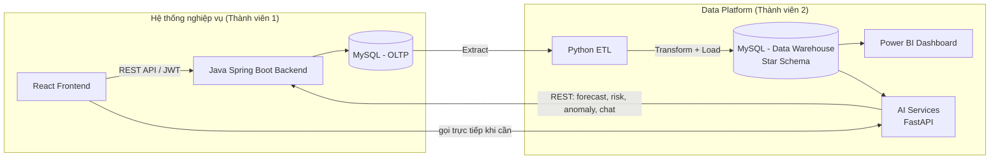

# Kiến trúc hệ thống

## Sơ đồ tổng quát

## Tech stack

| Lớp | Công nghệ | Ghi chú |
|---|---|---|
| Frontend | React (Vite) | Giao diện quản trị, tham khảo look & feel DMS (bảng dữ liệu dạng grid, sidebar module) |
| Backend | Java 17+, Spring Boot 3, Spring Data JPA, Spring Security (JWT) | REST API |
| CSDL OLTP | MySQL 8 | Dữ liệu giao dịch (transactional) |
| Build tool Backend | Maven | |
| Migration CSDL | Flyway | Versioned schema (`backend/src/main/resources/db/migration`) |
| ETL | Python (pandas, SQLAlchemy) | Extract OLTP → Transform → Load DW |
| Data Warehouse | MySQL 8 (star schema) | Fact/Dimension riêng biệt với OLTP |
| BI | Power BI Desktop | Kết nối trực tiếp DW qua MySQL connector |
| AI Services | Python (FastAPI) | Forecasting, Stock Risk, Anomaly Detection, Chatbot — mỗi service độc lập, expose REST API |
| Forecasting | statsmodels / Prophet / scikit-learn | Time-series theo sản phẩm |
| Anomaly Detection | scikit-learn (IsolationForest / Z-score) | Trên chuỗi thời gian nhập/xuất |
| Chatbot | LLM API (Claude/OpenAI) + truy vấn có cấu trúc trên DW | Trả lời dựa trên dữ liệu thật, không tự bịa số liệu |
| Containers (dev) | Docker Compose | MySQL OLTP + MySQL DW + Adminer |

## Nguyên tắc tách biệt OLTP / Data Warehouse

- **OLTP** (`erp_qlkho_oltp`) tối ưu cho ghi/đọc giao dịch, chuẩn hóa (3NF), do backend Java sở hữu — schema quản lý qua Flyway.
- **Data Warehouse** (`erp_qlkho_dw`) tối ưu cho truy vấn phân tích, denormalized (star schema), do pipeline ETL sở hữu — schema quản lý qua SQL script trong `data-warehouse/schema/`.
- AI Services đọc dữ liệu phân tích từ **Data Warehouse**, không đọc trực tiếp OLTP (tránh ảnh hưởng hiệu năng hệ thống giao dịch).
- Backend Java gọi AI Services qua REST khi cần hiển thị cảnh báo/dự báo/chatbot trên giao diện quản lý (hoặc Frontend gọi thẳng AI Services nếu không cần qua Backend).

## Giao tiếp giữa các service

Tất cả giao tiếp giữa Backend ↔ AI Services ↔ Frontend đều qua **REST API JSON**, không share database trực tiếp giữa các service khác domain. Chi tiết endpoint: [`../05-api-contract/api-endpoints.md`](../05-api-contract/api-endpoints.md)
