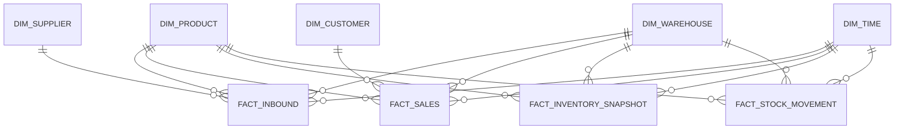

# Thiết kế Data Warehouse — Star Schema (`erp_qlkho_dw`)

DDL: [`data-warehouse/schema/01_dimensions.sql`](../../data-warehouse/schema/01_dimensions.sql) và [`02_facts.sql`](../../data-warehouse/schema/02_facts.sql)

## Sơ đồ

## Dimension tables

| Bảng | Nguồn OLTP | Cột chính |
|---|---|---|
| `dim_product` | `product`, `product_category` | `product_key` (surrogate), `product_code`, `product_name`, `category_name`, `unit` |
| `dim_supplier` | `supplier` | `supplier_key`, `supplier_code`, `supplier_name` |
| `dim_warehouse` | `warehouse` | `warehouse_key`, `warehouse_code`, `warehouse_name` |
| `dim_customer` | `customer` | `customer_key`, `customer_code`, `customer_name` |
| `dim_time` | sinh tự động (date spine) | `time_key` (yyyymmdd), `full_date`, `day`, `month`, `quarter`, `year`, `day_of_week`, `is_weekend` |

## Fact tables

| Bảng | Grain (1 dòng =) | Nguồn OLTP | Measures |
|---|---|---|---|
| `fact_inbound` | 1 dòng chi tiết phiếu nhập | `goods_receipt` + `goods_receipt_detail` | `quantity`, `unit_price`, `amount` |
| `fact_sales` | 1 dòng chi tiết đơn hàng đã CONFIRMED | `sales_order` + `sales_order_detail` | `quantity`, `unit_price`, `amount` |
| `fact_stock_movement` | 1 dòng `stock_transaction` | `stock_transaction` | `quantity`, `movement_type` (IN/OUT/ADJUST) |
| `fact_inventory_snapshot` | tồn kho cuối ngày theo product × warehouse | `stock` (snapshot theo lịch chạy ETL hàng ngày) | `quantity_on_hand` |

## Quy ước ETL

- Mọi fact table dùng **surrogate key** (không dùng ID gốc từ OLTP) — map qua bảng dimension tương ứng khi transform.
- `fact_inventory_snapshot` chạy **incremental theo ngày** (append 1 snapshot/ngày), không ghi đè — phục vụ phân tích xu hướng tồn kho theo thời gian.
- `fact_inbound`, `fact_sales`, `fact_stock_movement` chạy **incremental theo lần ETL** (chỉ lấy bản ghi mới kể từ lần chạy trước, dựa trên `created_at` / `updated_at` ở OLTP).
- Chi tiết logic: xem `etl/transform/` và `etl/README.md`.
