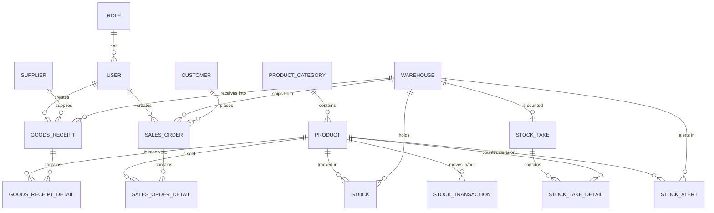

# Thiết kế CSDL OLTP (`erp_qlkho_oltp`)

DDL chạy thật (Flyway, nguồn sự thật): `backend/src/main/resources/db/migration/V1..V5__*.sql`
DDL gộp cả 5 file để xem toàn bộ quan hệ 1 chỗ (import vào MySQL Workbench/dbdiagram.io để vẽ ERD): [`full-schema-oltp.sql`](full-schema-oltp.sql)

## Sơ đồ quan hệ (rút gọn)

## Danh sách bảng

| Bảng | Mô tả | Module |
|---|---|---|
| `role`, `permission`, `role_permission`, `user` | Người dùng & phân quyền | Quản lý hệ thống |
| `product_category` | Danh mục sản phẩm (hỗ trợ cha/con qua `parent_id`) | Danh mục |
| `product` | Sản phẩm | Danh mục |
| `supplier` | Nhà cung cấp | Danh mục |
| `warehouse` | Kho | Danh mục |
| `customer` | Khách hàng | Bán hàng |
| `goods_receipt`, `goods_receipt_detail` | Phiếu nhập hàng & chi tiết | Nhập hàng |
| `sales_order`, `sales_order_detail` | Đơn hàng & chi tiết | Bán hàng |
| `stock` | Tồn kho hiện tại (product × warehouse, unique) | Tồn kho |
| `stock_transaction` | Lịch sử mọi biến động tồn kho (IN/OUT/ADJUST), tham chiếu nguồn gốc qua `reference_type` + `reference_id` | Tồn kho |
| `stock_take`, `stock_take_detail` | Phiếu kiểm kê & chênh lệch | Tồn kho |
| `stock_alert` | Ngưỡng cảnh báo sắp hết hàng theo product × warehouse | Tồn kho |

## Quy tắc nghiệp vụ quan trọng cần đảm bảo trong code (không chỉ ở DB)

1. **Xác nhận đơn hàng (SALE-04/05):** phải trong 1 transaction — kiểm tra đủ tồn kho → trừ `stock.quantity` → ghi `stock_transaction` (type=OUT, reference=sales_order). Nếu bất kỳ sản phẩm nào không đủ tồn → rollback toàn bộ đơn.
2. **Nhập hàng (IN-03):** cộng `stock.quantity` → ghi `stock_transaction` (type=IN, reference=goods_receipt) trong cùng transaction với việc lưu `goods_receipt_detail`.
3. **Kiểm kê (INV-04):** khi duyệt phiếu kiểm kê có chênh lệch → ghi `stock_transaction` (type=ADJUST) để lịch sử luôn khớp với `stock.quantity` hiện tại (không sửa `stock` trực tiếp mà không qua transaction log).
4. **`stock.quantity` luôn phải bằng tổng các `stock_transaction` liên quan** — đây là bất biến (invariant) nên viết test kiểm tra định kỳ.
